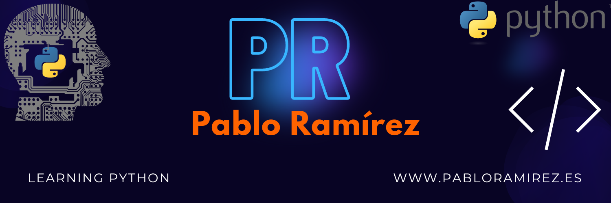
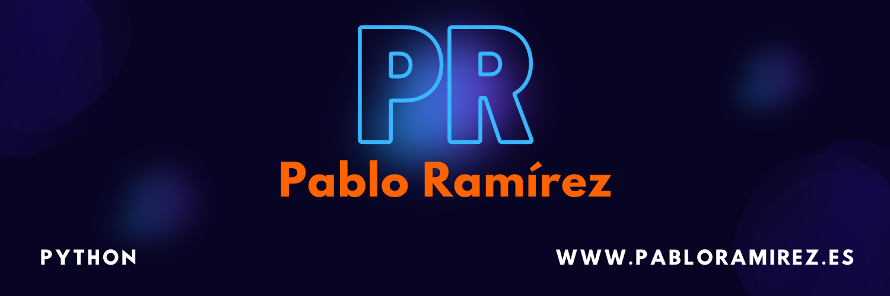

# Learning-python
### Mi estudio y aprendizaje de Python

## Scripts
### Little scripts to make a specific function

Empiezo a subir los primers scripts, sin un guión ni ruta a seguir

pasos a seguir
+ Numeros
+ Strings
+ Metodos
+ Clases
+ Objetos

Puntos importantes a dominar
+ Sintaxis y estructura del lenguaje: Es crucial comprender la sintaxis y la estructura del lenguaje, incluyendo la forma en que se definen las variables, se escriben las instrucciones y se organizan los bloques de código. Esto te permitirá escribir código válido y comprensible.

+ Tipos de datos y variables: Debes entender los diferentes tipos de datos disponibles en el lenguaje y cómo se utilizan para almacenar información. Además, es importante aprender cómo declarar y manipular variables, asignarles valores y realizar operaciones con ellas.

+ Estructuras de control: Las estructuras de control, como las sentencias condicionales (if-else, switch) y los bucles (for, while), te permiten controlar el flujo de ejecución de un programa. Debes aprender cómo utilizar estas estructuras para tomar decisiones y repetir tareas según sea necesario.

+ Funciones o métodos: Las funciones te permiten dividir el código en bloques reutilizables y modulares. Aprende cómo definir y utilizar funciones en el lenguaje, incluyendo la forma en que se pasan los parámetros y se retornan los valores.

+ Manejo de errores y excepciones: Es importante comprender cómo manejar los errores y excepciones que pueden ocurrir durante la ejecución de un programa. Aprende a utilizar los mecanismos proporcionados por el lenguaje para capturar y manejar estas situaciones de manera adecuada.

+ Bibliotecas o módulos: Muchos lenguajes de programación ofrecen bibliotecas o módulos que contienen funciones y utilidades adicionales para realizar tareas específicas. Aprender a utilizar estas bibliotecas te permitirá aprovechar funcionalidades existentes y acelerar el desarrollo de tus proyectos.

+ Depuración y pruebas: Aprende a utilizar herramientas de depuración para identificar y solucionar errores en tu código. También es importante comprender cómo realizar pruebas para verificar el funcionamiento correcto de tus programas.

+ Buena práctica de programación: Adquirir conocimientos sobre las buenas prácticas de programación te ayudará a escribir código legible, mantenible y eficiente. Esto incluye el uso de nombres descriptivos para variables y funciones, comentarios adecuados, organización del código, entre otros aspectos.

Un curso de Python del gran moureDev que vamos a ir siguiendo entre otros contenidos multimedia y analogicos:
https://www.youtube.com/watch?v=Kp4Mvapo5kc

